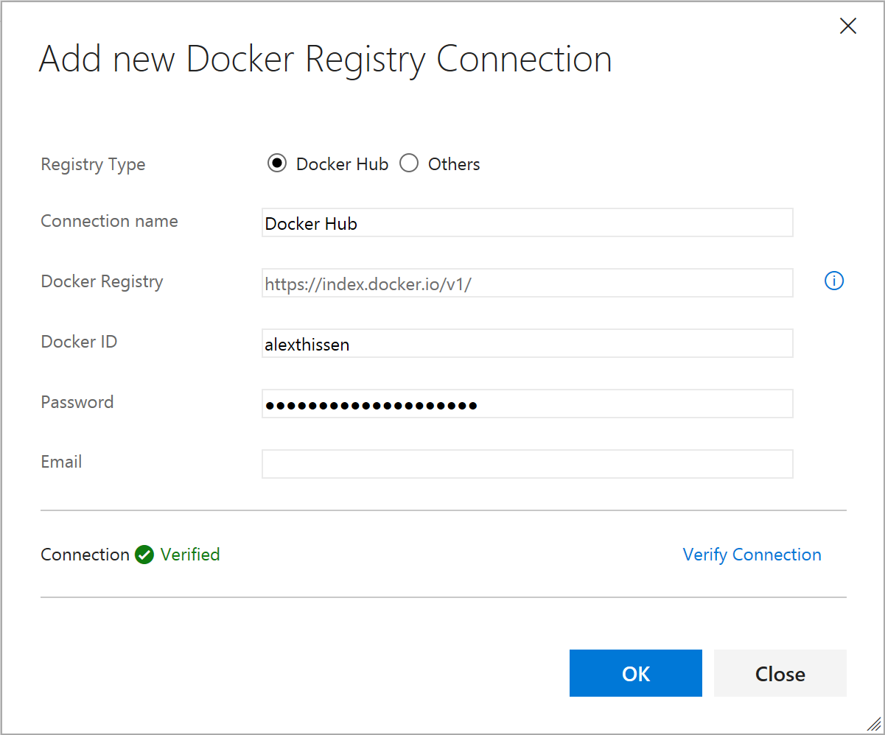
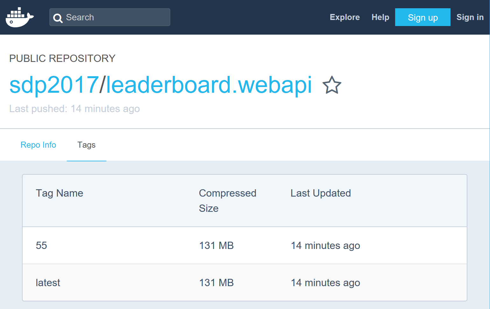

# Lab 7 - VSTS Build and release pipelines

Goals for this lab:
- Create build pipeline to build images
- Create release pipeline for deploying images to registry
- Deploy images to cluster

## Working with VSTS

Before you can get started with building pipelines, you need a Visual Studio Team Services (VSTS) account and a team project. You can use an existing VSTS account, or create a new one at [Visual Studio](https://www.visualstudio.com).

Also, your cloned Git repository needs to be pushed to the VSTS proj

## Create build pipelines

Login to your VSTS account and switch to the correct team project. Go to the `Code` tab and check that your source code is there. Switch to `Build and Release` and create a new definition for a Build pipeline.

From the available templates select the `ASP.NET with Containers` template to give yourself a head start.


Under the `Process` section for the build process, select `Hosted Linux (Preview)` as the Agent queue


Notice that this template assumes that you will use an Azure Container Registry. You can use one if you create it. The lab expects you to use the previously created Docker Hub registry.

Inspect the various tasks in the pipeline. You can see that there are a couple of tasks related to building the source code for .NET Full Framework and intended for the Windows Operating System:
- Use NuGet 4.3.0
- NuGet restore
- Build solution

Since you will use a Docker container to build the sources and images for Linux, these three steps are implicit in the `docker-compose.ci.build.yml` compose file. Remove the first three tasks from the pipeline.

Add a new Docker Compose task and name it `Build solution`. Change the Docker Compose file to be `docker-compose.ci.build.yml` and specify `up` as the compose command.

After this new initial step there is compiled source code in the `bin\Docker\Release` folder 

Moving on to the next three tasks:


Since you will use the Docker Hub registry created earlier, set the `Container Registry Type` to `Container Registry` instead of `Azure Container Registry` for each of those Docker Compose tasks. 

Create a Docker Registry Connection by clicking the `+ New` link.


Fill in the details for the connection, specifying your credentials.



Select the connection to your Docker Hub from the dropdown. 

Notice how the Docker Compose file is already preselected to be `docker-compose.yml`. This aligns with the previous design decision to only include actual images relevant to the application components to be in this Docker Compose file.

You can specify additional Docker Compose files and one is already selected. Leave it there and create an empty `docker-compose.ci.yml` file in the root of your solution.

Repeat this process for the other two Docker Compose tasks and choose the Docker Hub connection. Notice the `Qualify Images` checkbox for `Push images` to qualify the image names with the registry name. Similarly, the `Lock images` task.

In the `Copy Files` task set the `Contents` property to these files:
```
**/docker-compose.production.yml
**/docker-compose.production.*.yml
**/docker-compose.azure.yml
```

Save the build definition and queue a new build. Check whether the build completes successfully and fix any errors that might occur. Inspect the build artifacts and download the `docker-compose.yml` file. It should resemble this:
```
services:
  gamingwebapp:
    build:
      context: ./src/RetroGaming2017/src/Applications/GamingWebApp
      dockerfile: Dockerfile
    image: sdp2017/gamingwebapp@sha256:e198caef40f1e886c3a70db008a69aa9995dc00301a035867757aad9560d9088
  leaderboard.webapi:
    build:
      context: ./src/RetroGaming2017/src/Services/Leaderboard.WebAPI
      dockerfile: Dockerfile
    image: sdp2017/leaderboard.webapi@sha256:40b83b74b7e6c5a06da2adbaf5d99aec64cde63c16a66956091cbddb93349f86
version: '3.0'
```

Notice how the image names have an appended SHA256 hash value to confirm their identity in the registry. This file can be used to release the images into the cluster later on.

When your build has completed without errors, you should find that your Docker Hub registry has a new image that is tagged with the build number. Verify this at your Docker Registry located at https://hub.docker.com/r/<registryname>, replacing `<registryname>` with your registry's name.



If this all is working correctly you are ready to release the new image to the cluster.

## Release new images to cluster

The newly built Docker images are now located in the Docker Hub. You can release these to your cluster by instructing it to update the stack deployed earlier.

Create a new release definition from the Releases tab in VSTS. Choose an `Empty process` and name the first environment `Production`. Navigate to its empty task list and set the Agent selection to `Hosted` under the Agent phase.

Add a Docker task to execute a remote command over SSH. You need a SSH connection that you can create from the task property for the connection.

## Improve deployment details

You can indicate how the individual services will be deployed inside your composition. The compose file allows you to indicate deployment characteristics per service with a `deploy` section. 

Add a `deploy` section to the web application to indicate it should be deployed with 2 running replicas (copies):
```
deploy:
  replicas: 2
```

Similarly, do the same for the Web API service, but additionally describe its restart behavior.
```
deploy:
  replicas: 1
  restart_policy:
  condition: on-failure
  delay: 5s
  max_attempts: 3
```

## Wrapup

In this lab you have created a build pipeline to build and push the container images for your .NET solution. You used a release pipeline to deploy the composition to a cluster in Azure. Additionally, you added deployment details to the composition file to describe the replicas and restart behavior of your stack.